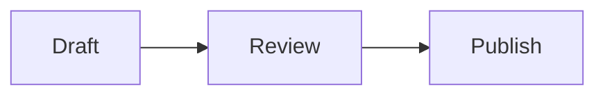

# Obsidian Markdown authoring

Use this reference when creating or reviewing `.md` files for Obsidian.

## Contents

- [Compatibility model](#compatibility-model)
- [Document structure](#document-structure)
- [Properties](#properties)
- [Links and block references](#links-and-block-references)
- [Embeds](#embeds)
- [Callouts](#callouts)
- [Tables, tasks, and lists](#tables-tasks-and-lists)
- [Code, math, diagrams, and footnotes](#code-math-diagrams-and-footnotes)
- [Tags and comments](#tags-and-comments)
- [Validation checklist](#validation-checklist)

## Compatibility model

Obsidian combines CommonMark, GitHub Flavored Markdown, LaTeX, and Obsidian-specific extensions. Favor ordinary Markdown when interoperability matters. Use wikilinks, block references, embeds, callouts, comments, highlights, and properties when the target is an Obsidian vault.

Markdown remains source text. Write notes that are understandable without rendered decoration. Obsidian does not render Markdown syntax inside raw HTML elements.

## Document structure

- Use ATX headings (`#` through `######`) in hierarchy order.
- Use one blank line between paragraphs and after a heading.
- Add a blank line before lists, blockquotes, tables, and fenced code blocks when they follow prose.
- Do not use a heading merely to bold a short label.
- Use two trailing spaces only for a deliberate hard line break; prefer a paragraph break otherwise.
- Use a longer outer fence when documenting fenced code blocks.

Example:

````markdown
## Deployment

Run the validation first:

```bash
make test
```

Then review the report.
````

## Properties

Place properties at the very start of the file between `---` delimiters. Property names must be unique within a note. Supported core types include text, lists, numbers, checkboxes, dates, date-times, and tags.

```yaml
---
title: Deployment notes
aliases:
  - Release procedure
tags:
  - operations
  - deployment
status: draft
related: "[[Service Overview]]"
reviewed: 2026-08-10
cssclasses:
  - operations-note
---
```

Follow these constraints:

- Quote wikilinks in YAML values.
- Represent `tags`, `aliases`, and `cssclasses` as YAML lists for consistent editing.
- Use ISO dates (`YYYY-MM-DD`) and date-times (`YYYY-MM-DDTHH:mm:ss`) when possible.
- Keep properties small and atomic. Markdown is not rendered inside properties.
- Preserve unknown keys and value types when editing an existing note.
- Do not duplicate a property key.

## Links and block references

```markdown
[[Note name]]
[[Note name|Readable label]]
[[Note name#Section]]
[[Note name#^block-id]]
[[#Section in this note]]
[External documentation](https://example.com/docs)
```

Append a block identifier to a paragraph:

```markdown
This paragraph is addressable. ^stable-id
```

For a list, blockquote, or other multi-line block, put the identifier on its own line after the block. Use stable, meaningful IDs only when needed; Obsidian can generate IDs for interactive links.

Obsidian can use wikilinks or Markdown links internally. Match the vault's **Files and links** setting and existing style. Wikilinks are convenient in Obsidian; Markdown links are more portable. Percent-encode spaces in Markdown link destinations or wrap the destination in angle brackets.

## Embeds

Prefix an internal link with `!`:

```markdown
![[Note name]]
![[Note name#Section]]
![[Note name#^block-id]]
![[diagram.png|640]]
![[diagram.png|640x480]]
![[document.pdf#page=3]]
![[document.pdf#height=400]]
![[board.canvas]]
```

Use normal Markdown image syntax for external images. Treat embeds as live transclusions: edits to the source change every location where it is embedded.

## Callouts

```markdown
> [!warning] Verify access first
> Keep the current session open.
>
> - Test the new route.
> - Preserve a recovery path.
```

Use `+` for expanded foldable callouts and `-` for collapsed callouts:

```markdown
> [!faq]- Why is this hidden?
> The callout starts collapsed.
```

Common types include `note`, `abstract`, `info`, `todo`, `tip`, `success`, `question`, `warning`, `failure`, `danger`, `bug`, `example`, and `quote`. Unsupported types render like `note` unless CSS or a plugin defines them.

Every body line must remain part of the blockquote. Use `>` for a blank line within a callout. Add another `>` level to nest a callout.

## Tables, tasks, and lists

Use a header row and delimiter row for tables:

```markdown
| Setting | Value |
| --- | --- |
| Port | `698` |
| Guide | [[SSH migration\|Runbook]] |
```

Escape the pipe in a wikilink alias or embed size when it appears inside a table. Perfect source alignment is optional; clear alignment is useful for hand-maintained tables.

Keep simple list items together:

```markdown
- First item
- Second item
  - Nested item

- [x] Verified
- [ ] Pending
```

Obsidian accepts any character inside task brackets as a completed state, but use `[x]` and `[ ]` unless the vault has a defined task-status convention.

## Code, math, diagrams, and footnotes

Use backticks for inline code and fenced blocks for multi-line code. Include a language identifier when known.

Use `$...$` for inline math and `$$...$$` for display math. Obsidian renders math with MathJax.

Use a `mermaid` fence for diagrams:

````markdown

````

Use ordinary or named footnotes:

```markdown
This claim needs context.[^source]

[^source]: Add the supporting detail here.
```

Inline footnotes use `^[Text]`. Obsidian renders them in Reading view, but not in Live Preview.

## Tags and comments

Inline tags begin with `#`; nested tags use `/`. Tags cannot contain spaces, are case-insensitive, and must contain at least one non-numeric character. Prefer the `tags` property when consistent metadata matters.

```markdown
#project/active

Visible text %%hidden editorial note%% continues.

%%
This block is hidden in Reading view.
%%
```

Do not put secrets in comments. Comments remain in the plaintext file and sync like other content.

## Validation checklist

- Frontmatter begins on line 1, closes, parses as YAML, and contains unique keys.
- Headings have content and follow a sensible hierarchy.
- Paragraph, list, table, callout, and code boundaries have intentional blank lines.
- Fences, wikilinks, embeds, comments, emphasis, and math delimiters balance.
- Table rows have compatible columns; escape wikilink pipes inside cells.
- Internal destinations and embedded files exist when the vault is available.
- No accidental trailing whitespace exists except deliberate hard breaks.
- The note is readable in Source mode and visually checked in Live Preview or Reading view when possible.

The bundled `check_markdown_style.py` checks a limited set of YAML, delimiter, fence, and spacing conditions. It does not implement Obsidian's renderer, resolve every link, validate table shape, balance math or emphasis, or replace visual review.
